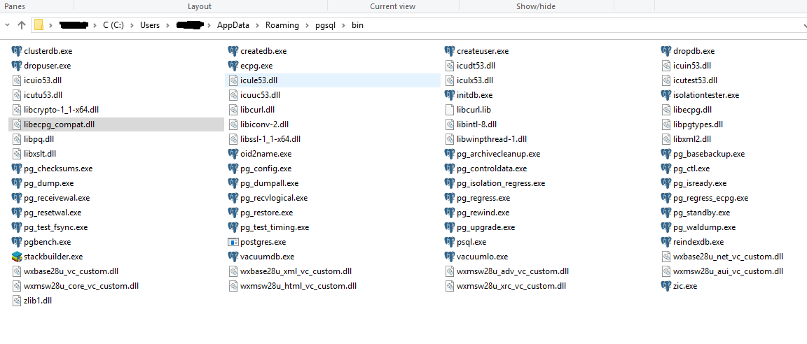
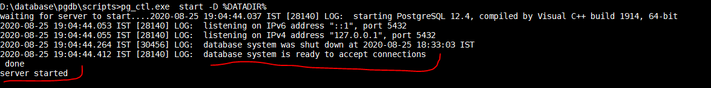
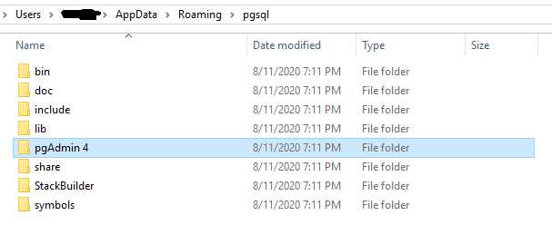

# <center>Postgres DB Setup for Windows 
<p align="center">
    
</p>

### Kindly follow the steps bellow
<br>

1.  install database binary from official site of [postgres](https://www.postgresql.org/download/).

2.  Kindly follow the installation [guide](https://www.postgresql.org/download/windows/).

3.  Note down the binary Path after postgres installation, it should have following files.
    

4.  Create a directory to point the DB clusters. 

5.  Give Permission to the directory. 

6.  initiate  database using script [ **Kindly note this is one time activity** ] ```initdb -D <path/to/db_cluster/directory>```                   
                                    OR
    Update the DATADIR variable to  ```path/to/db_cluster/directory``` in script ```initilizeDB.bat```.run the same from cmd.

7.  Once the DB is initilize we can start the DB server using script startDB.bat.  
    

8.  Postgres will create default database postgres with default user postgres. If defalut user is not created then default user needs be created using ```createUser.bat -s postgres```.   

9.  After DB initilization we can run pgadmin, this will help us to run sql script from browser.

10. Find the Path of pgadmin in postgres installation directory 
    .

11. Go to pgadmin4/bin directory and run the script ```pgAdmin4.exe```. This will open new window in browser.

12. Create two user ```app_admin``` and ```app_user``` from default supers user .
    ```
        psql /* connect default DB using default super user */ 

        CREATE ROLE app_admin WITH
        LOGIN
        NOSUPERUSER
        INHERIT
        NOCREATEDB
        NOCREATEROLE
        NOREPLICATION
        CONNECTION LIMIT 10
        PASSWORD 'app_admin';
        
        CREATE ROLE app_user WITH
        LOGIN
        NOSUPERUSER
        INHERIT
        NOCREATEDB
        NOCREATEROLE
        NOREPLICATION
        CONNECTION LIMIT 90
        PASSWORD 'app_user';
    ```

13. Create two two new Role select_role and update_role     
    ```
        psql /* connect default DB using default super user */

        CREATE ROLE select_role WITH
        LOGIN
        NOSUPERUSER
        INHERIT
        NOCREATEDB
        NOCREATEROLE
        NOREPLICATION;

        CREATE ROLE update_role WITH
        LOGIN
        NOSUPERUSER
        INHERIT
        NOCREATEDB
        NOCREATEROLE
        NOREPLICATION;
    ```

14. GRANT select_role, update_role TO app_user; 
    ``` 
    psql /* connect default DB using default super user */

    GRANT select_role, update_role TO app_user;
    ```

15. app_admin will create all the db object and app_user will only use the db Objects.

16. create a new data base name app_data from cmd line 
    ```
    createdb.exe -O app_admin  app_data 
    ```

17. create new schema app_schema from  app_admin on app_data database.
    ```
        psql -d app_data -U app_admin /* connect app_data DB using app_admin user */

        CREATE SCHEMA app_schema AUTHORIZATION app_admin;
    ```

18. grant useage to select_role and update_role for app_schema.
    ```
        psql -d app_data -U app_admin /* connect app_data DB using app_admin user */

        GRANT USAGE ON SCHEMA app_schema TO select_role;

        GRANT USAGE ON SCHEMA app_schema TO update_role;
    ```

19. create table from app_user and insert data into the table.

    ```
        psql -d app_data -U app_admin /* connect app_data DB using app_admin user */

        CREATE TABLE app_schema."userInfo" (
        email character varying COLLATE pg_catalog."default" NOT NULL,
        password character varying COLLATE pg_catalog."default" NOT NULL,
        creation_date date DEFAULT CURRENT_DATE,
        update_date date NOT NULL DEFAULT CURRENT_DATE,
        CONSTRAINT userInfo_pk PRIMARY KEY (email)
        );

        INSERT INTO app_schema."userInfo"(password, email, creation_date, update_date)VALUES ('password', 'r.das699@gmail.com', '2020-08-25', '2020-08-25');

        INSERT INTO app_schema."userInfo"(password, email, creation_date, update_date)VALUES ('password', 'debmallya.6@gmail.com', '2020-08-25', '2020-08-25');

    ```

20. grant select on table to select_role and grant update, insert to update_role
    ```
        psql -d app_data -U app_admin /* connect app_data DB using app_admin user */

        grant select on app_schema."userInfo" to select_role;

        grant update, insert   ON TABLE app_schema."userInfo" TO update_role;
    ``` 

21. grant select_role and update_role to app_user from default super user       .
    ```
        psql /* connect default DB using default super user */

        grant update_role to app_user;  /* From Super User */
        grant select_role to app_user;  /* From Super User */
    ```

22. Now we can repeat the steps 19. 20, and 22 for new objects creation from app_admin. and we can do select insert update from app_user.

<br>


---

*  ### DB Start up ### 
   ```
        startDB.bat
   ``` 

*  ### DB connect from cmd ### 
   ```
        psql -d app_data -U app_admin /* connect app_data DB using app_admin user */
   ```    

*  ### DB connect from postgres admin  ###
   ```
        kidly follow step 9 , 10 and 11.
   ```

*  ### DB Shutdown ### 
   ```
        shutdownDB.bat
   ``` 